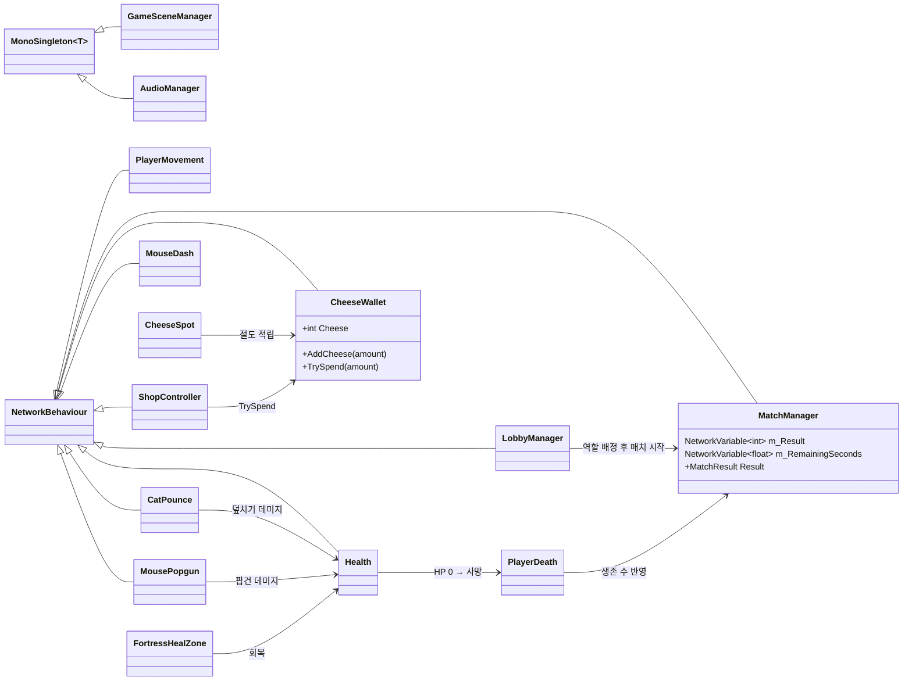
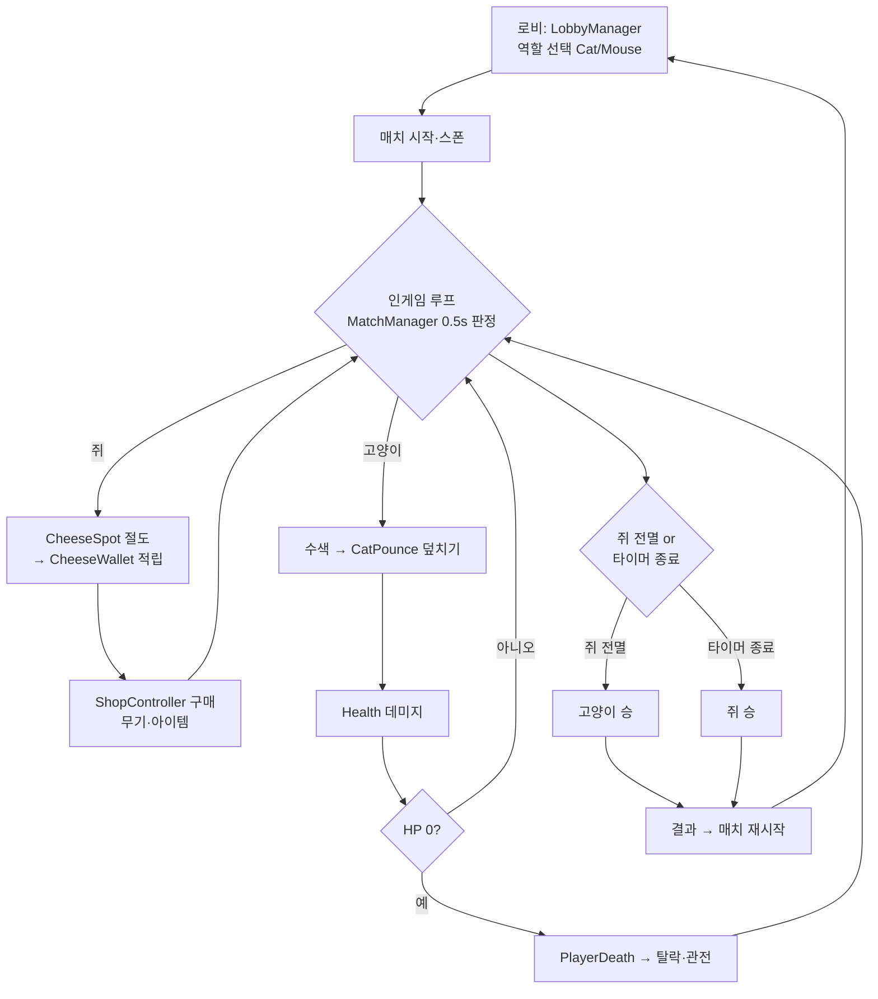

# 코드 다이어그램

> 2026-07-26 기준 `Assets/Scripts/` 요약. 상세 멤버는 코드 참조.

## 클래스 다이어그램

```mermaid
classDiagram
    direction LR

    class MatchManager {
        NetworkVariable~int~ m_Result
        NetworkVariable~float~ m_RemainingSeconds
        +MatchResult Result
    }
    class LobbyManager
    class GameSceneManager
    class AudioManager

    class PlayerMovement
    class PlayerDeath
    class Health
    class CatPounce
    class MousePopgun
    class MouseDash
    class CheeseWallet {
        +int Cheese
        +AddCheese(amount)
        +TrySpend(amount)
    }
    class ShopController
    class CheeseSpot
    class FortressHealZone

    NetworkBehaviour <|-- MatchManager
    NetworkBehaviour <|-- LobbyManager
    NetworkBehaviour <|-- PlayerMovement
    NetworkBehaviour <|-- Health
    NetworkBehaviour <|-- CatPounce
    NetworkBehaviour <|-- MousePopgun
    NetworkBehaviour <|-- MouseDash
    NetworkBehaviour <|-- CheeseWallet
    NetworkBehaviour <|-- ShopController
    MonoSingleton~T~ <|-- GameSceneManager
    MonoSingleton~T~ <|-- AudioManager

    LobbyManager --> MatchManager : 역할 배정 후 매치 시작
    CatPounce --> Health : 덮치기 데미지
    MousePopgun --> Health : 팝건 데미지
    Health --> PlayerDeath : HP 0 → 사망
    PlayerDeath --> MatchManager : 생존 수 반영
    CheeseSpot --> CheeseWallet : 절도 적립
    ShopController --> CheeseWallet : TrySpend
    FortressHealZone --> Health : 회복
```

## 게임 워크플로우

```mermaid
flowchart TD
    Lobby[로비: LobbyManager<br>역할 선택 Cat/Mouse] --> Spawn[매치 시작·스폰]
    Spawn --> Loop{인게임 루프<br>MatchManager 0.5s 판정}

    Loop -->|쥐| Steal[CheeseSpot 절도<br>→ CheeseWallet 적립]
    Steal --> Shop[ShopController 구매<br>무기·아이템]
    Shop --> Loop

    Loop -->|고양이| Hunt[수색 → CatPounce 덮치기]
    Hunt --> Dmg[Health 데미지]
    Dmg --> Death{HP 0?}
    Death -->|예| Dead[PlayerDeath → 탈락·관전]
    Death -->|아니오| Loop
    Dead --> Loop

    Loop --> End{쥐 전멸 or<br>타이머 종료}
    End -->|쥐 전멸| CatWin[고양이 승]
    End -->|타이머 종료| MouseWin[쥐 승]
    CatWin --> Restart[결과 → 매치 재시작]
    MouseWin --> Restart
    Restart --> Lobby
```
